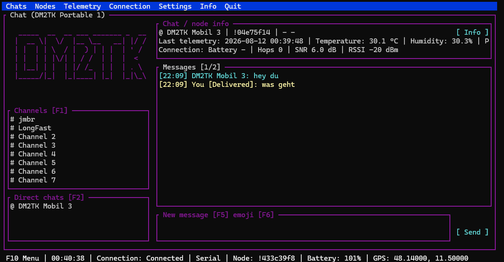
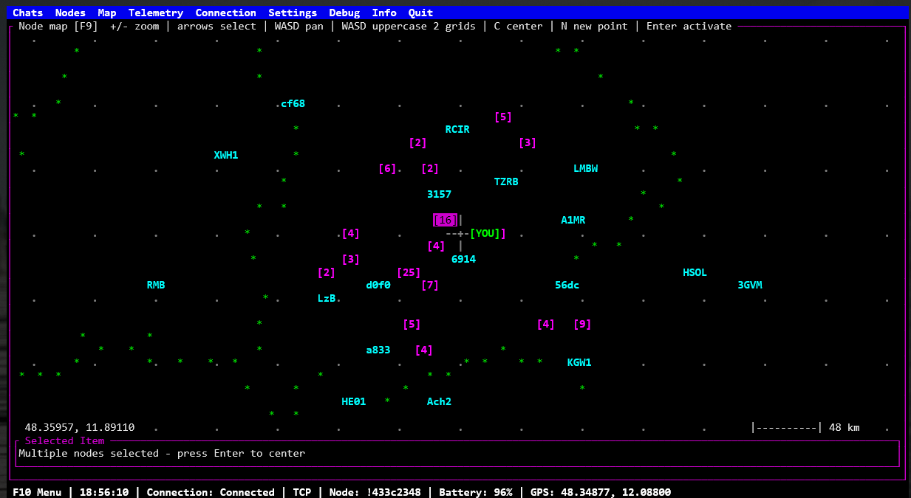
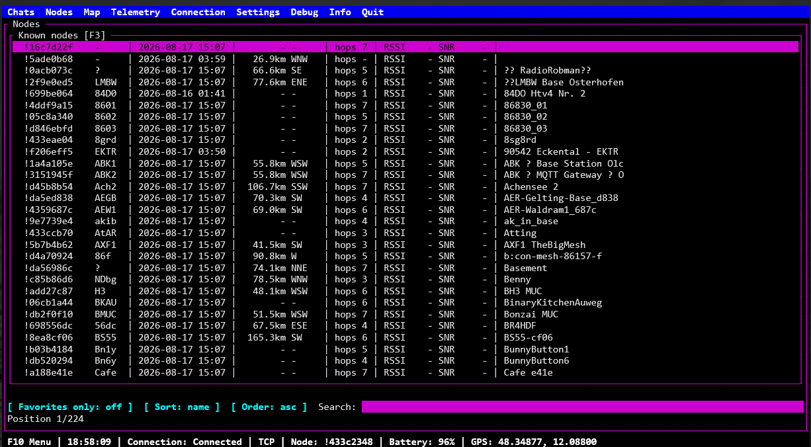
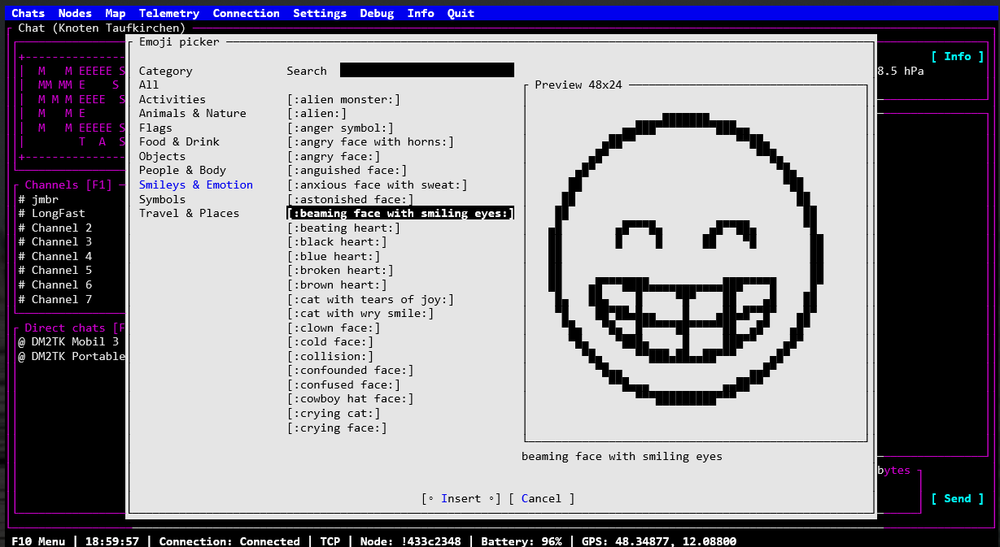

# MeshtasticConsoleClient

MeshtasticConsoleClient is a C# 7.3 / .NET Framework 4.7.2 client library and terminal
application for the native Meshtastic Protobuf API. It connects by USB/serial
or TCP, stores messages, nodes and telemetry in SQLite, and supports optional
Telegram gateways and local or HTTP chat bots.

Source code and releases: https://github.com/kr-saibot/MeshtasticConsoleClient

## Screenshots

### Chat



### Node map



### Node list



### Emoji picker



## Features

- Native serial and TCP transports with automatic reconnect and connection statistics
- Node, channel, text-message, position and telemetry handling
- SQLite message, node and telemetry storage
- Terminal chat interface with direct chats, channels, node details and telemetry
- Interactive node map with clustering, pan/zoom, GPS centring, XML overlays and
  optional offline raster or OpenMapTiles-compatible vector MBTiles backgrounds
- Selectable OSM roads, buildings and map features with English-name preference
- Stored node-position history with an automatic latest-available 24-hour window
- Filterable and sortable node list with saved view settings
- Optional Telegram gateways, local chat bots and HTTP bots
- Configurable appearance, logo rotation and emoji replacement/picker support
- Windows desktop host with ConPTY rendering, mouse support and persistent settings

## Windows desktop host

`MeshtasticConsoleHost.exe` provides a native Windows window for the otherwise
unchanged terminal application. It uses Windows ConPTY and the Windows Terminal
renderer, so keyboard navigation, Tab, cursor keys, mouse input, Unicode symbols
and terminal colours work as they do in a modern terminal.

Keep `MeshtasticConsoleHost.exe`, `ConsoleClient.exe` and all files and folders
from the release package together. On startup, the host always uses the
`ConsoleClient.exe` in its own directory first. If it is missing, the host uses
a previously selected valid fallback or opens a file picker. A different client
can also be selected manually from the window system menu.

The host adds the following Windows integration:

- Configurable terminal font sizes
- Saved window size, font size, dark title bar and selected fallback client
- Optional minimized startup and automatic startup with Windows
- Close button minimizes the window; **Close** in the system menu and
  **Alt+F4** terminate the application
- Taskbar flashing when the client sends a terminal BEL alarm
- Selectable alarm audio with a bundled default alert sound


Host settings are stored in `settings.ini` beside `MeshtasticConsoleHost.exe`.
The ConsoleClient continues to store `meshtastic-settings.xml` and its SQLite
database in the ConsoleClient working directory, which is the directory that
contains the selected `ConsoleClient.exe`.

The host requires 64-bit Windows 10 version 1809 or newer. ConPTY is a Windows
API; it is not an additional separately licensed component.

## Node map

The Node Map displays all nodes with known positions relative to the current GPS
position. It supports keyboard and mouse navigation, zooming, node selection,
clustering, a coordinate crosshair, distance scale and configurable colours.
Additional places and boundary data can be loaded from XML overlay files. Active
overlays and their rendering priority are managed through **Map > Overlays** and
are restored on the next start.

An offline background map can be placed in the `osm` directory beside the
application. Raster MBTiles containing PNG/JPEG tiles and vector MBTiles using
Mapbox PBF tiles are supported. The lightweight vector renderer is designed for
OpenMapTiles-compatible layers including roads, railways, boundaries, buildings,
water and land use. If several `.mbtiles` files are present, the first one in
alphabetical order is opened. Press **8** on the map to enable or disable it.
Detailed creation and validation instructions are included in
`osm/MBTILES-CREATION.txt` and `osm/MBTILES-ERSTELLEN.txt`.

Map colours are cached for the current viewport and vector features use a spatial
index, keeping redraws responsive even with detailed extracts. Grid, crosshair,
scale, nodes, overlays and position-history markers retain the underlying map
colour. Selected foreground markers are displayed with inverted foreground and
background colours. A left click on an unoccupied map position displays the OSM
feature in **Selected Item**. English names are preferred, followed by the
default/local name, German name and road reference. After panning or centring,
the visible node, overlay or history point beneath the crosshair is selected;
otherwise the corresponding OSM feature or the offline map itself is shown.

Keys **1** through **7** toggle configured XML overlays, **8** toggles the
offline background, **9** toggles position history and **0** toggles known nodes.
Position history opened from a node automatically covers the 24 hours ending at
the newest stored position, even when that position is older than one day. Brief
map and layer notifications remain visible for up to four seconds and close
immediately when any key is pressed.

Incoming text messages use the Meshtastic packet `rx_time` as their displayed
receive time when firmware supplies it, with the PC receive time used only as a
fallback. During shutdown, the status line reports whether the client is waiting
for the mesh connection, Telegram gateways or queued database writes. This makes
slow Linux shutdowns easier to diagnose.

## Emoji picker

The emoji picker provides keyboard-friendly selection and preview of emoji in a
terminal. Open it with **F6**, navigate with the cursor keys and insert the
selected emoji with **Enter**. Where a terminal cannot render an emoji directly,
the client can use generated ASCII representations or configured replacements.

## Build

Prerequisites:

- .NET SDK with .NET Framework 4.7.2 targeting support
- NuGet package restore access
- A Meshtastic device, a TCP-connected Meshtastic service, or both for live use

```powershell
dotnet restore MeshtasticNet472.sln
dotnet build MeshtasticNet472.sln --configuration Release
```

For the Linux output configuration:

```powershell
dotnet build MeshtasticNet472.sln --configuration Linux
```

The terminal client is built to `src/ConsoleClient/bin/<configuration>/net472/`.
The Windows host project is located in `src/ConsoleHost/` and targets x64.
Release builds do not include `.pdb` debug-symbol files. These symbols are not
needed at runtime; use a Debug build when source-level crash diagnostics are
required.
On Linux it is intended to run with Mono and uses the distribution-provided
`libsqlite3.so` library.

## Running

Start `ConsoleClient.exe`. On its first start, enter the serial or TCP settings
through the Settings menu. The application writes local settings and its SQLite
database next to the executable; these files can contain private information
and are deliberately excluded from version control.

### Linux serial-port permissions

On Ubuntu and many other Linux distributions, serial devices such as
`/dev/ttyACM0` and `/dev/ttyUSB0` are accessible only to members of the device's
group, which is usually `dialout`. If TCP works but serial connections fail for
both nRF and ESP32 devices, check the port and current group memberships:

```bash
ls -l /dev/ttyACM0
ls -l /dev/ttyUSB0
groups
```

If the port belongs to `dialout`, add the current user to that group:

```bash
sudo usermod -aG dialout "$USER"
```

Log out completely and log in again, or restart the computer, before retrying.
Use `groups` to confirm that `dialout` is active. Do not run ConsoleClient with
`sudo`; correct the device-group permissions instead. Also ensure that no web
client or other application still has the selected serial port open.

## Appearance and logos

The terminal colours, frames and message colours can be changed in the
Appearance settings. ASCII logos are loaded from `src/ConsoleClient/logo/` and
can be replaced or extended with your own text files. The Logo settings control
whether the logo frame is shown, its size and the automatic rotation interval.

The emoji replacement list can be regenerated from official Unicode data:

```powershell
cd src\ConsoleClient
powershell -ExecutionPolicy Bypass -File .\tools\GenerateEmojiReplacements.ps1
```

## Security and privacy

Never commit `meshtastic-settings.xml`, SQLite databases, logs, Telegram bot
tokens, chat IDs or other credentials. If a token is exposed, revoke it at
BotFather immediately and create a replacement token before publishing.

## Credits

Created by Tobias Krista with assistance from artificial intelligence
(OpenAI Codex).

## License

Copyright (c) 2026 Tobias Krista.

This project is licensed under the **GNU General Public License, version 3.0
only (GPL-3.0-only)**. See [LICENSE](LICENSE). The Meshtastic Protobuf
definitions included in this repository are also GPL-3.0; their original
license copy is retained in `LICENSE-Meshtastic-Protobufs.txt`.

See [THIRD-PARTY-NOTICES.md](THIRD-PARTY-NOTICES.md) for third-party component
attribution and release-packaging notes.
