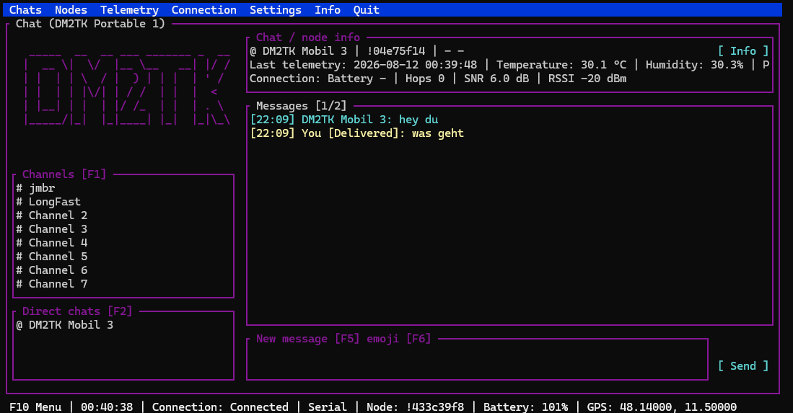
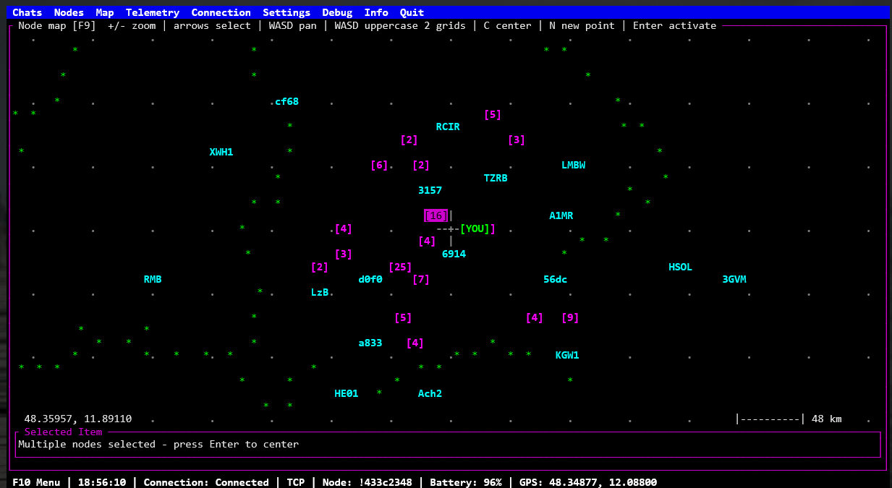
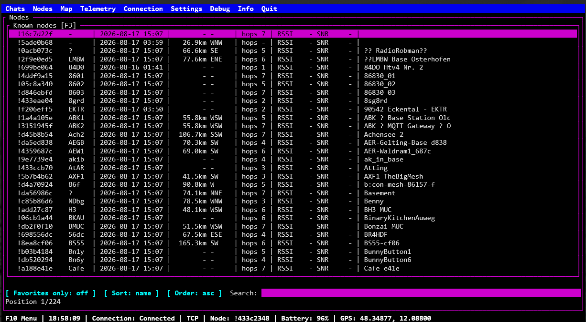
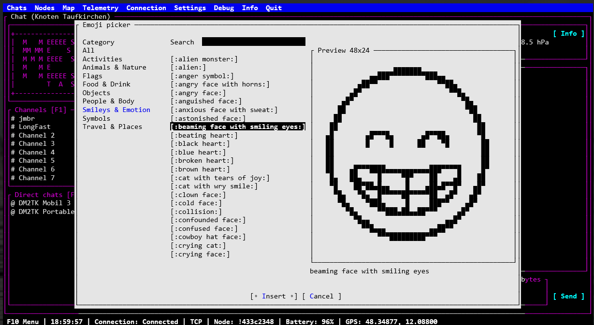

# MeshtasticConsoleClient

MeshtasticConsoleClient is a C# 7.3 / .NET Framework 4.7.2 client library and terminal
application for the native Meshtastic Protobuf API. It connects by USB/serial
or TCP, stores messages, nodes and telemetry in SQLite, and supports optional
Telegram gateways and local or HTTP chat bots.

Source code and releases: https://github.com/kr-saibot/MeshtasticConsoleClient

## Screenshots

### Chat



### Node map



### Node list



### Emoji picker



## Features

- Native serial and TCP transports with automatic reconnect and connection statistics
- Separately configurable DTR and RTS control lines for serial/COM connections
- Node, channel, text-message, position and telemetry handling
- SQLite message, node and telemetry storage
- Terminal chat interface with direct chats, channels, node details, telemetry and
  message-detail actions for opening the sender, starting a direct chat or locating
  the sender on the map
- Interactive node map with clustering, pan/zoom, GPS centring, XML overlays and
  optional offline raster or OpenMapTiles-compatible vector MBTiles backgrounds
- Selectable OSM roads, buildings and map features with English-name preference
- Stored node-position history with an automatic latest-available 24-hour window
- Optional map hop-limit filter, including hop limit zero for directly received nodes
- Filterable and sortable node list with saved view settings
- Meshtastic receive-time handling, device-clock synchronisation and distinct delivery
  states for direct and channel messages
- Optional Telegram gateways, local chat bots and HTTP bots
- Configurable appearance, logo rotation and emoji replacement/picker support
- Windows desktop host with ConPTY rendering, mouse support and persistent settings
- Bounded Linux shutdown that avoids prolonged Terminal.Gui/Mono exit delays

## Windows desktop host

`MeshtasticConsoleHost.exe` provides a native Windows window for the otherwise
unchanged terminal application. It uses Windows ConPTY and the Windows Terminal
renderer, so keyboard navigation, Tab, cursor keys, mouse input, Unicode symbols
and terminal colours work as they do in a modern terminal.

Keep the release directory structure intact: the client and its dependencies
belong in the Windows output root; the host and its dependencies belong in the
**Host** subdirectory. This prevents dependency-version collisions. The host
locates the packaged client or uses a selected fallback. A different client can
also be selected manually from the window system menu.

The host adds the following Windows integration:

- Configurable terminal font sizes
- Saved window size, font size, dark title bar and selected fallback client
- Optional minimized startup and automatic startup with Windows
- Close button minimizes the window; **Close** in the system menu and
  **Alt+F4** terminate the application
- Taskbar flashing when the client sends a terminal BEL alarm
- Selectable alarm audio with a bundled default alert sound


Host settings are stored in `settings.ini` beside `MeshtasticConsoleHost.exe`.
The ConsoleClient continues to store `meshtastic-settings.xml` and its SQLite
database in the ConsoleClient working directory, which is the directory that
contains the selected `ConsoleClient.exe`.

The host requires 64-bit Windows 10 version 1809 or newer. ConPTY is a Windows
API; it is not an additional separately licensed component.

## Node map

The Node Map displays all nodes with known positions relative to the current GPS
position. It supports keyboard and mouse navigation, zooming, node selection,
clustering, a coordinate crosshair, distance scale and configurable colours.
Additional places and boundary data can be loaded from XML overlay files. Active
overlays and their rendering priority are managed through **Map > Overlays** and
are restored on the next start.

An offline background map can be placed in the `osm` directory beside the
application. Raster MBTiles containing PNG/JPEG tiles and vector MBTiles using
Mapbox PBF tiles are supported. The lightweight vector renderer is designed for
OpenMapTiles-compatible layers including roads, railways, boundaries, buildings,
water and land use. If several `.mbtiles` files are present, the first one in
alphabetical order is opened. Press **8** on the map to enable or disable it.
Detailed creation and validation instructions are included in
`osm/MBTILES-CREATION.txt` and `osm/MBTILES-ERSTELLEN.txt`.

Map colours are cached for the current viewport and vector features use a spatial
index, keeping redraws responsive even with detailed extracts. Grid, crosshair,
scale, nodes, overlays and position-history markers retain the underlying map
colour. Selected foreground markers are displayed with inverted foreground and
background colours. A left click on an unoccupied map position displays the OSM
feature in **Selected Item**. English names are preferred, followed by the
default/local name, German name and road reference. After panning or centring,
the visible node, overlay or history point beneath the crosshair is selected;
otherwise the corresponding OSM feature or the offline map itself is shown.

Keys **1** through **7** toggle configured XML overlays, **8** toggles the
offline background, **9** toggles position history and **0** toggles known nodes.
Position history opened from a node automatically covers the 24 hours ending at
the newest stored position, even when that position is older than one day. Brief
map and layer notifications remain visible for up to four seconds and close
immediately when any key is pressed.

**Map > Hop Limit** enables a hop-count filter independently from its numeric
value. A limit of `0` therefore shows directly received nodes rather than
disabling the filter. Nodes without known hop information are hidden while the
filter is enabled. Node details show both the last-received timestamp and a
readable relative age, for example `(2 days 10 hours ago)`.

### Overlay shapes and measurement

XML overlays support points, lines, circles and rectangles with configurable
colours, fill symbols and fill density. The symbol picker includes the CP437
symbols and additional Unicode symbols; the Windows host preserves these symbols
during terminal output. **Copy current map** includes rendered shapes and markers.

Press **M** repeatedly to cycle measurement through **Off**, **Line**, **Circle**
and **Rectangle**. Temporary shapes are drawn with **M** characters between the
measurement anchor and the cursor. **Selected Item** shows distance and direction
for a line, radius and area for a circle, or width, height and area for a rectangle.
Press **N** to create an item with the current measurement shape; when measurement
is off, a point is selected. Creating the item turns measurement off.

Press **Space** to centre a selected item. **Enter** or a double click on a node
cluster opens a list showing short name, hops, long name and last-heard time.
Select a node to open its details.

### Map sharing

Configure **Map point sharing** and its channel to exchange overlay objects with
other clients. Points, lines, circles, rectangles and their fill settings are
transmitted as ordinary Meshtastic text messages. **Map item details > Send again**
resends the selected object with its existing UUID. Objects already present at the
receiver are deduplicated by UUID; resending does not update an existing object.
Deletion can also be shared.

Messages must fit within 233 UTF-8 bytes; long names or descriptions may need to
be shortened. The format and receiving rules are documented in
[MAP-SYNC-PROTOKOLL.md](MAP-SYNC-PROTOKOLL.md).

### Position markers

**Map > Position Markers** configures the own marker's call sign, free-text info,
colour and centre symbol. Markers look like crosshairs, render above all other map
layers and are stored only in memory. Each Meshtastic node ID has one marker;
incoming updates replace that node's marker.

Press **O** to set the own marker. Settings choose the crosshair or current device
GPS position, whether to ask before setting it, and whether received marker
messages are evaluated. GPS mode requires a valid device position. With map point
sharing enabled, setting the marker also sends it to the configured channel.

Press **L** to open the narrow marker list near the right edge. It shows call sign,
distance and update age. Moving through the list centres and selects each marker;
**Enter** or a double click opens its info box. Details include free text, update
age, distance and direction relative to the own marker, or device GPS if no own
marker exists. Actions centre the map, open node details, start a direct chat or
delete the marker locally after confirmation. A later received update can recreate
a deleted marker. Markers disappear when the application exits.

### Included Germany overlays

- Federal-state boundaries use red asterisk (*) lines, including island outlines.
- The water and city overlay contains blue **w** river and lake outlines,
  brown filled **.** circles for major cities and green points for smaller places.
  City-circle radii approximate municipality area, rather than built-up area.
  Autobahns are not included.

See the [water and city overlay documentation](src/ConsoleClient/map/germany-water-cities-motorways.md)
for coverage, approximation details, sources and licences. Its historical filename
is retained for compatibility with saved overlay settings.

## Messages and delivery status

Incoming text messages use the Meshtastic packet `rx_time` as their displayed
receive time when firmware supplies it, with the PC receive time used only as a
fallback. The client sets the connected device clock early in the connection so
that subsequently received packets can contain a useful receive timestamp.

The message-details window can open the sender's node details, start a direct
chat, or centre and select the sender on the map. When the messages window gains
focus, it selects the timestamp of the newest message automatically.

Direct messages remain **Queued at device** until the corresponding acknowledgement
arrives and then change to **Delivered**. Channel broadcasts cannot receive an
individual delivery acknowledgement, so a successfully queued channel message is
shown as **Sent** instead of remaining indefinitely at **Queued at device**.

On Linux, shutdown uses bounded waits for background services and queued database
writes, restores the terminal and then exits directly. This prevents the
Terminal.Gui/Mono event loop from consuming CPU for minutes or hours after a
long-running session.

### Alerts

**Settings > Alerts > Suppress alerts for ///MAP messages** excludes map-object,
deletion and position-marker messages from desktop notifications, Windows beeps,
terminal BEL, repeated beeps, unread-message logo blinking, alert HTTP requests
and alert shell commands. Messages remain in chat and map synchronisation remains
active. The option is off by default.

## Emoji picker

The emoji picker provides keyboard-friendly selection and preview of emoji in a
terminal. Open it with **F6**, navigate with the cursor keys and insert the
selected emoji with **Enter**. Where a terminal cannot render an emoji directly,
the client can use generated ASCII representations or configured replacements.

## Build

Prerequisites:

- .NET SDK with .NET Framework 4.7.2 targeting support
- NuGet package restore access

Create both Windows and Linux builds with the repository's build script:

~~~powershell
.\tools\Build-All.ps1
~~~

Canonical output directories:

- Windows: C:\Users\Tobias\Documents\ConsoleClientBuilds\Windows
- Linux: C:\Users\Tobias\Documents\ConsoleClientBuilds\Linux

The script uses .build-staging temporarily and overwrites program files while
preserving existing runtime data, including meshtastic-settings.xml,
meshtastic-messages.db and Host/settings.ini. The Windows host and its dependencies
are packaged in Windows/Host separately from the client.

Release builds omit debug symbols. The Windows host targets x64.
On Linux, run the client with Mono and the distribution's libsqlite3.so.

## Running

Start `ConsoleClient.exe`. On its first start, enter the serial or TCP settings
through the Settings menu. The application writes local settings and its SQLite
database next to the executable; these files can contain private information
and are deliberately excluded from version control.

### Serial/COM control lines (DTR and RTS)

The connection settings provide separate **DTR enabled** and **RTS enabled**
options for serial/COM-port connections. The defaults are DTR enabled and RTS
disabled. Changes take effect on the next connection and do not affect TCP.

Some ESP32-S3 boards and USB serial circuits, including certain Heltec WiFi LoRa
32 V3 configurations, connect DTR and RTS to reset or boot-control signals. If a
device resets, appears to shut down, or loses its clock when ConsoleClient closes
the port, disable both DTR and RTS and reconnect. Other boards or drivers may need
DTR to communicate, so keep the default unless the device exhibits this problem.

### Linux serial-port permissions

On Ubuntu and many other Linux distributions, serial devices such as
`/dev/ttyACM0` and `/dev/ttyUSB0` are accessible only to members of the device's
group, which is usually `dialout`. If TCP works but serial connections fail for
both nRF and ESP32 devices, check the port and current group memberships:

```bash
ls -l /dev/ttyACM0
ls -l /dev/ttyUSB0
groups
```

If the port belongs to `dialout`, add the current user to that group:

```bash
sudo usermod -aG dialout "$USER"
```

Log out completely and log in again, or restart the computer, before retrying.
Use `groups` to confirm that `dialout` is active. Do not run ConsoleClient with
`sudo`; correct the device-group permissions instead. Also ensure that no web
client or other application still has the selected serial port open.

## Appearance and logos

The terminal colours, frames and message colours can be changed in the
Appearance settings. ASCII logos are loaded from `src/ConsoleClient/logo/` and
can be replaced or extended with your own text files. The Logo settings control
whether the logo frame is shown, its size and the automatic rotation interval.

The emoji replacement list can be regenerated from official Unicode data:

```powershell
cd src\ConsoleClient
powershell -ExecutionPolicy Bypass -File .\tools\GenerateEmojiReplacements.ps1
```

## Security and privacy

Never commit `meshtastic-settings.xml`, SQLite databases, logs, Telegram bot
tokens, chat IDs or other credentials. If a token is exposed, revoke it at
BotFather immediately and create a replacement token before publishing.

## Credits

Created by Tobias Krista with assistance from artificial intelligence
(OpenAI Codex).

## License

Copyright (c) 2026 Tobias Krista.

This project is licensed under the **GNU General Public License, version 3.0
only (GPL-3.0-only)**. See [LICENSE](LICENSE). The Meshtastic Protobuf
definitions included in this repository are also GPL-3.0; their original
license copy is retained in `LICENSE-Meshtastic-Protobufs.txt`.

See [THIRD-PARTY-NOTICES.md](THIRD-PARTY-NOTICES.md) for third-party component
attribution and release-packaging notes.
